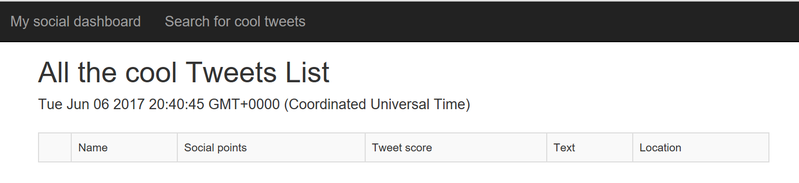

# Web application development with Node.js and Express using DocumentDB
This sample shows you how to use the Microsoft Azure DocumentDB service to store and access data from a Node.js Express application hosted on Azure Websites. 

For a complete end-to-end walk-through of creating this application, please refer to the [full tutorial on the Azure documentation page](https://azure.microsoft.com/en-us/documentation/articles/documentdb-nodejs-application/)

## Running this sample
1. Deploy the arm template in arm/template.json to azure

  

It will deploy the following resources
- DocumentDb
- App service
- Application Insights
- Search service
- DocumentDb Connection configuration inside the app service appsettings

## Deploy this sample to Azure

1. If you haven't already, enable a git repository for your Azure Website. You can find instructions on how to do this [here](https://azure.microsoft.com/en-us/documentation/articles/web-sites-publish-source-control-git/#step4).

2. Add your Azure Website as a git remote.

		git remote add azure https://username@your-website.scm.azurewebsites.net:443/your-website.git

3. Deploy by pushing to the remote.

		git push azure master

4. In a few seconds, git will finish publishing your web application and launch a browser where you can see your handy work running in Azure!

## About the code
The code included in this sample is intended to get you going with a simple Node.js Express application that connects to Azure DocumentDB with the express intent of demonstrating how to interact with DocumentDB using the [documentdb npm package](https://www.npmjs.com/package/documentdb). It is not intended to be a set of best practices on how to build scalable enterprise grade web applications. This is beyond the scope of this quick start sample. 

## More information

- [Azure DocumentDB Documentation](https://azure.microsoft.com/en-us/documentation/services/documentdb/)
- [Azure DocumentDB Node SDK](https://www.npmjs.com/package/documentdb)
- [Azure DocumentDB Node SDK Reference Documentation](http://azure.github.io/azure-documentdb-node/)
